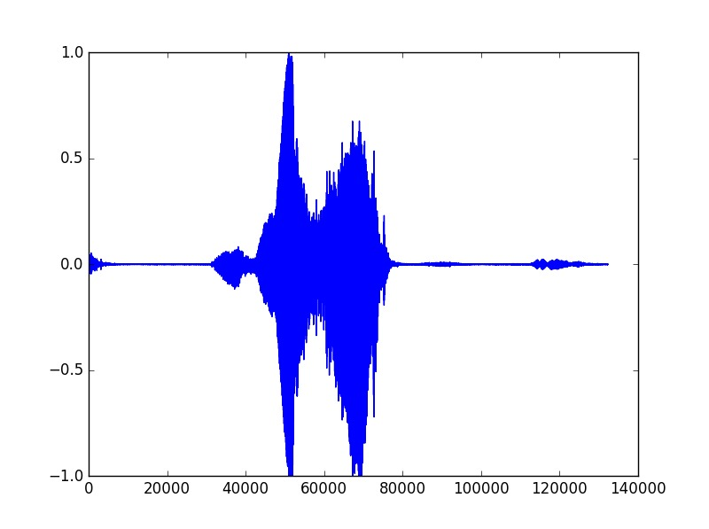
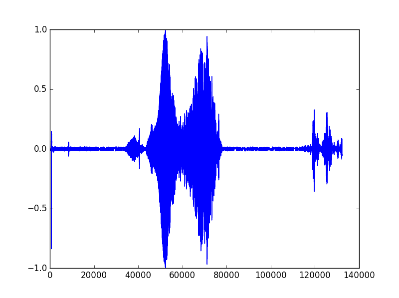
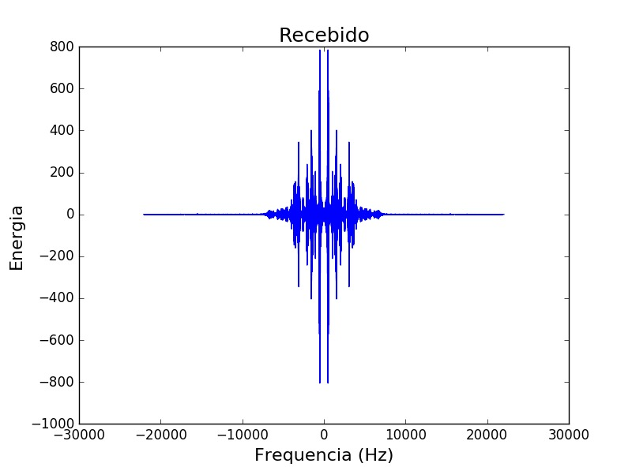
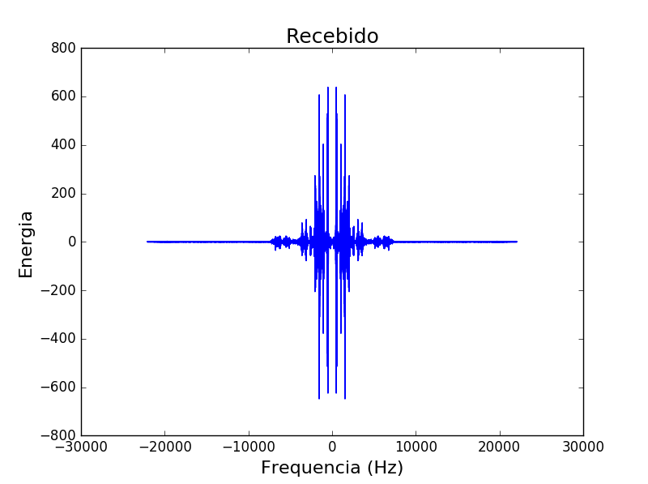
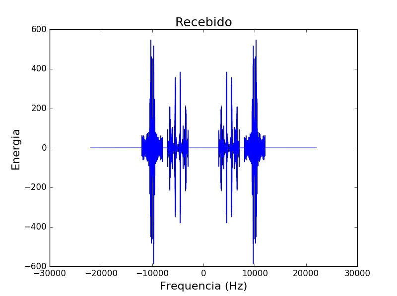
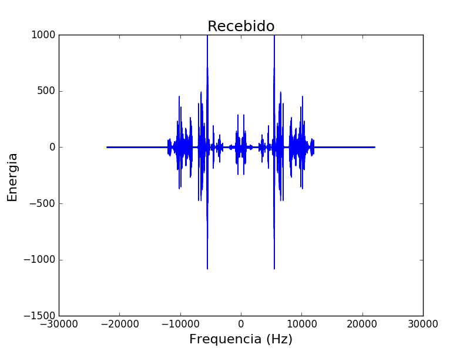

# Projeto 2.1

Por Jean Luca e Pedro de la Peña

## Modulação  

A modulação consiste na multiplicação de um sinal por uma portadora, dada pela fórmula

p(t) = A*cos(2πf*t)

sendo A a amplitude, fc a frequencia arbitrária da portadora e t o tempo.

Ao realizar a modulação, torna-se possível enviar mais um sinal em um mesmo meio. Contudo, no final da recepção é preciso que ocorra uma demodulação para recuperar os áudios originais. O processo consiste na multiplicação pela portadora anteriormente utilizada. 

## Portadoras utilizadas

A freqquência de corte utilizada foi de 2000Hz. Levando isso em conta, as frequências das duas portadoras utilizadas deveriam ser maiores que o valor de corte e devem ser inferiores ao valor de 22050Hz, metade do valor da frequência de amostragem. Contudo, levamos em conta valores até 18000Hz pois os microfones imbutidos nos (nossos) notebooks não são muito eficazes quando expostos a frequências superiores à estas.

Além disso, as frequências das portadoras não podem ser muito próximas umas das oturas para não se misturarem e impossibilitarem os audios originais de serem recuperados no final do processo de recepção. 
Isto posto, temos as frequências de 5000Hz e 10000Hz.

Contudo, o código permite que o usuário defina as frequências das portadoras, porém deve ter em mente o que foi listado anteriormente

## Bandas ocupadas
Devido ao fato da frequência de corte (apresentada nos gráficos) ser de 2000Hz, a banda utilizada é de 4000Hz. 

Contudo, o código permite que o usuário defina a frequência de corte que irá utilizar, o que consequentemente, afetará o tamanho da banda. Em termos gerais, a banda é equivalente a 2 vezes a frequência de corte. 

## Gráficos
| Grafico   | Sinal Transmitido       |Sinal Recebido        |
 |:-----:|-------------------------|----------------------|
 | Normal  | Transmitido       | Recebido        |
 |x      |         |      |
 |  Fourier de um dos sinais  |  Transmitido       | Recebido        |
 |x      |         |      |
 | Fourier dos sinais combinados   |  Transmitido       | Recebido        |
 |x      |         |      |

## Comparação entre enviado e recebido

O audio recebido tem volume mais baixo que o audio originalmente gravado. Isso se deve à aplicação do filtro passa baixa e também ao fato do sinal ter sido transmitido em um ambiente não ideal, onde há dissipação e perdas de energia, além do microfone também não ser ideal.

